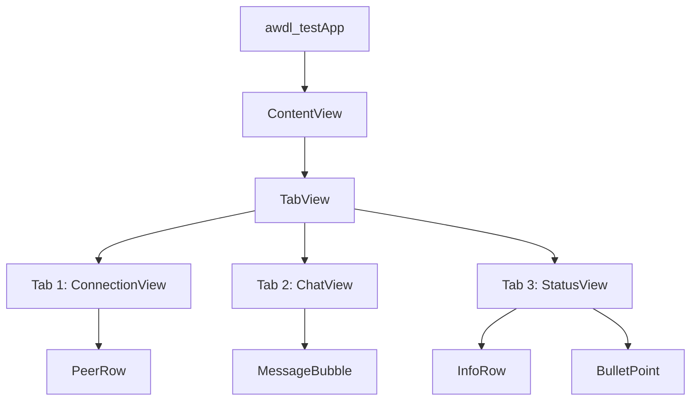

# AWDL Test - iOS Peer-to-Peer Communication Demo

一个基于 **Apple Wireless Direct Link (AWDL)** 技术的 iPhone 演示应用，使用 `MultipeerConnectivity` 框架实现设备间的近场发现、连接和即时通讯功能，**无需共享 Wi-Fi 网络**。

## 技术栈

| 技术 | 说明 |
|------|------|
| **SwiftUI** | 声明式 UI 框架 |
| **MultipeerConnectivity** | Apple 近场通信框架 |
| **Combine** | 响应式数据绑定 |
| **os.log** | 系统级日志 |
| **MVVM 架构** | Model-View-ViewModel 设计模式 |

## 项目结构

```
awdl_test/
├── awdl_testApp.swift          # App 入口，启动 ContentView
├── models/
│   ├── PeerDevice.swift         # 设备模型 - 表示发现的对等设备
│   └── PeerMessage.swift        # 消息模型 - 表示设备间交换的消息
├── services/
│   └── MultipeerManager.swift   # 核心服务 - 管理所有 MultipeerConnectivity 操作
├── views/
│   ├── ContentView.swift        # 主视图 - TabView 导航容器
│   ├── ConnectionView.swift     # 连接视图 - 设备发现与连接管理
│   ├── ChatView.swift           # 聊天视图 - 消息收发界面
│   └── StatusView.swift         # 状态视图 - 连接状态与设备信息展示
└── Assets.xcassets/             # 资源文件（图标、颜色等）
```

## 功能详解

### 1. 设备发现与连接（ConnectionView）

应用提供两个核心服务开关：

- **Advertise（广播）**：开启后，当前设备对附近设备可见，通过 `MCNearbyServiceAdvertiser` 广播服务类型 `awdl-connect`，并附带设备型号信息。收到连接邀请时**自动接受**。
- **Browse（搜索）**：开启后，通过 `MCNearbyServiceBrowser` 扫描附近正在广播的设备，发现的设备实时显示在列表中。

发现设备后，用户可点击 **Connect** 按钮发起连接邀请（30 秒超时）。界面实时展示：
- 已发现设备列表（含连接状态指示灯：🔴 未连接 / 🟠 连接中 / 🟢 已连接）
- 已连接设备列表
- 一键断开所有连接
- 工具栏菜单支持快速启动/停止所有服务

### 2. 即时通讯（ChatView）

连接建立后，设备间可进行实时文本聊天：

- **消息发送**：输入文本后点击发送按钮或按回车键，消息通过 `MCSession.send()` 以 `.reliable` 模式发送给所有已连接的对等设备
- **消息接收**：通过 `MCSessionDelegate` 的 `didReceive data` 回调接收消息，自动解码并显示
- **消息格式**：每条消息包含发送者名称、内容、时间戳和唯一 ID（`PeerMessage` 模型，使用 JSON 编解码）
- **UI 特性**：
  - 气泡式聊天界面（蓝色=自己，灰色=对方）
  - 顶部连接状态栏（橙色警告/绿色已连接）
  - 自动滚动到最新消息
  - 空状态占位提示

### 3. 状态监控（StatusView）

提供全面的运行状态信息：

- **设备信息**：本机名称、广播状态（Active/Inactive）、搜索状态
- **连接统计**：已发现设备数、已连接设备数、消息总数
- **已连接设备详情**：展示每个已连接设备的名称和状态
- **AWDL 技术说明**：介绍 Apple Wireless Direct Link 的关键特性

## 核心架构

### MultipeerManager（核心服务层）

`MultipeerManager` 是整个应用的核心，作为 `ObservableObject` 驱动所有 UI 更新：

```
MultipeerManager : NSObject, ObservableObject
├── MCSession                    # 会话管理（加密模式：.required）
├── MCNearbyServiceAdvertiser    # 广播服务
├── MCNearbyServiceBrowser       # 发现服务
├── MCSessionDelegate            # 会话事件回调（连接状态变化、数据接收）
├── MCNearbyServiceAdvertiserDelegate  # 广播事件回调（接收邀请）
└── MCNearbyServiceBrowserDelegate     # 发现事件回调（发现/丢失设备）
```

**数据流：**

```mermaid
graph TD
    A[MultipeerManager] -->|@Published| B[ConnectionView]
    A -->|@Published| C[ChatView]
    A -->|@Published| D[StatusView]
    B -->|startAdvertising / startBrowsing / invitePeer| A
    C -->|sendMessage| A
    E[MCSession] -->|delegate callbacks| A
    F[MCNearbyServiceAdvertiser] -->|didReceiveInvitation| A
    G[MCNearbyServiceBrowser] -->|foundPeer / lostPeer| A
```

### 数据模型

- **PeerDevice**：封装 `MCPeerID`，提供连接状态描述（`stateDescription`）和状态颜色（`stateColor`），实现 `Identifiable` 和 `Hashable` 协议
- **PeerMessage**：消息实体，实现 `Identifiable` 和 `Codable` 协议，支持 JSON 序列化在设备间传输

### 视图层级



`ContentView` 通过 `@StateObject` 创建 `MultipeerManager` 实例，并通过 `.environmentObject()` 注入到所有子视图中。

## AWDL 技术要点

- **无需共享 Wi-Fi**：AWDL 使用独立的 5GHz Wi-Fi 信道进行点对点通信
- **自动发现**：设备在近场范围内自动发现彼此
- **不干扰现有网络**：AWDL 通信不影响设备当前的 Wi-Fi 连接
- **加密通信**：会话使用 `.required` 加密级别，确保数据安全
- **服务类型**：`awdl-connect`（1-15 个字符，小写字母、数字和连字符）

## 运行要求

- **Xcode** 15.0+
- **iOS** 17.0+（使用了 `onChange(of:)` 新 API 和 `.symbolEffect` 修饰符）
- **真机测试**：MultipeerConnectivity 需要在真实设备上测试，模拟器不支持 AWDL
- 需要至少 **两台 iOS 设备** 才能完整测试连接和通讯功能

## 使用流程

1. 在两台 iPhone 上安装并运行应用
2. 在 **Connect** 标签页中，两台设备都开启 **Advertise** 和 **Browse**
3. 在已发现设备列表中点击 **Connect** 发起连接
4. 连接成功后，切换到 **Chat** 标签页即可开始聊天
5. 在 **Status** 标签页可查看实时连接状态和统计信息
