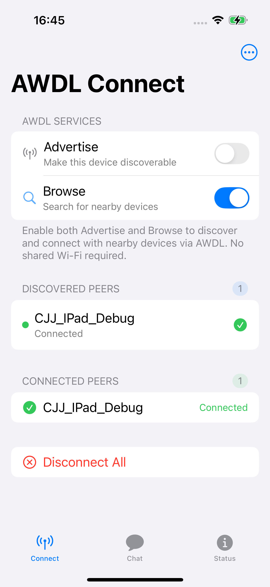
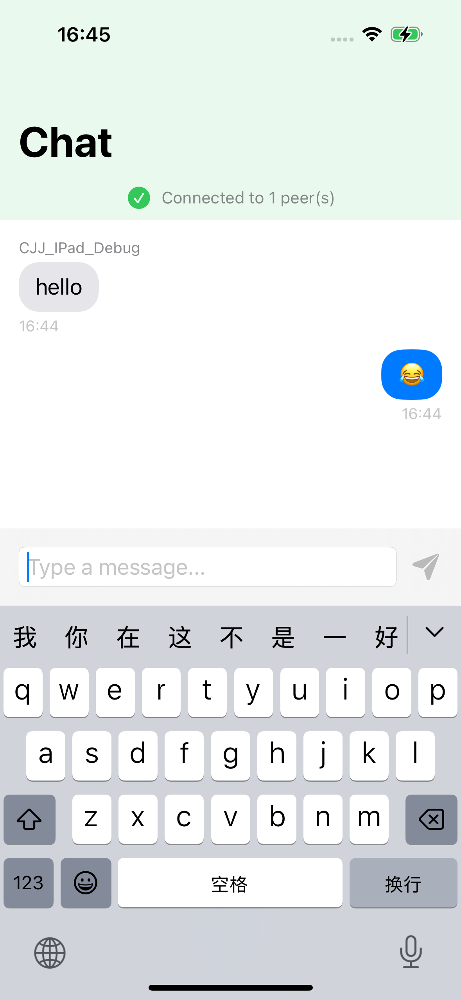
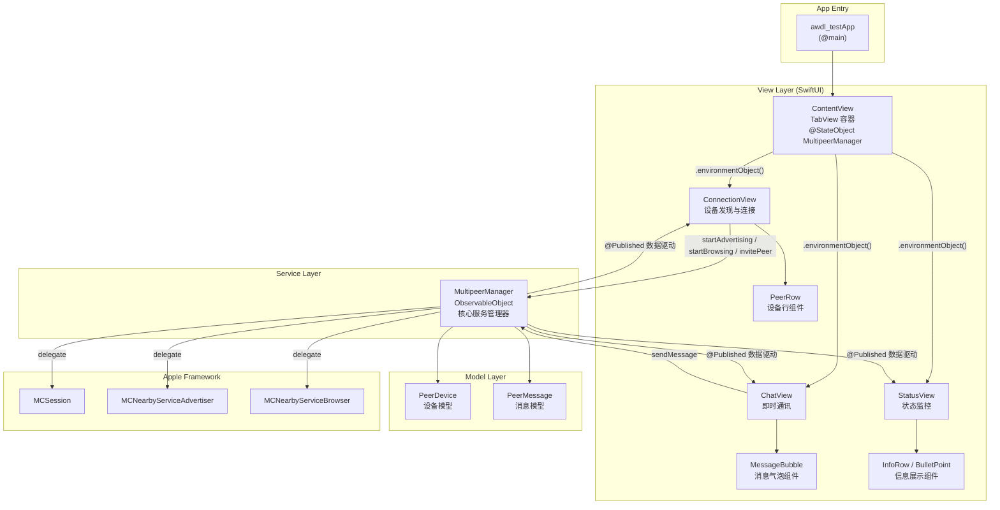
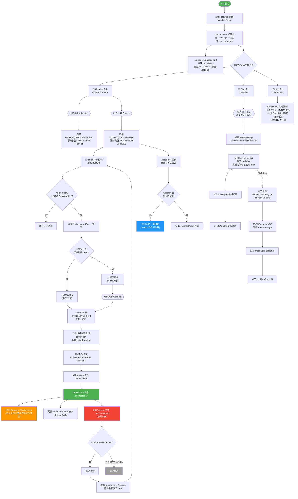

# 基于AWDL协议的近场连接

## 框架使用简介

Apple通信核心部分使用的是MultipeerConnectivity框架，UI部分使用的是SwiftUI框架、Combine支持响应式编程

## 设备支持

- [x] IPhone
- [x] IPad
- [x] MacOS

## 目前问题解决情况

- [x] awdl连接极其不稳定，加固 
- [x] 发现上一次连接的设备，进行自动连接

## 效果展示

### 一、服务界面

### 二、聊天界面
   

 

## 项目架构概览

### 项目架构

### 完整业务UML流程图

